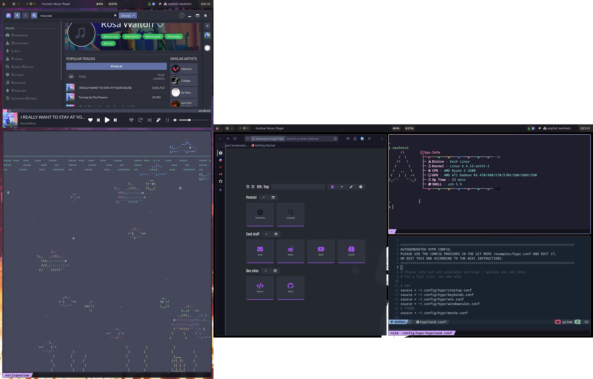

# Dotfiles

The Arch rice isn't finished, so this is still a W.I.P and may be updated sooner with screenshots and more configs.

Hyprpaper will need to be edited with whatever wallpaper you choose.

⚠️ I am not fully aware of what is in [wallpapers](./config/wallpapers/) as I just used some tool to scrape a bunch years ago and just kept it as is.

nvim is using [NvChad](https://github.com/NvChad/NvChad) but i dungoofed commiting it with this.

- Several components were taken from [linuxmobile's dotfiles](https://github.com/linuxmobile/hyprland-dots) to jumpstart the rice.

- Firefox is using [catppuccin](https://github.com/catppuccin/firefox) theme and [vertical tabs](https://github.com/ranmaru22/firefox-vertical-tabs) via [tab center reborn](https://addons.mozilla.org/en-US/firefox/addon/tabcenter-reborn/).
