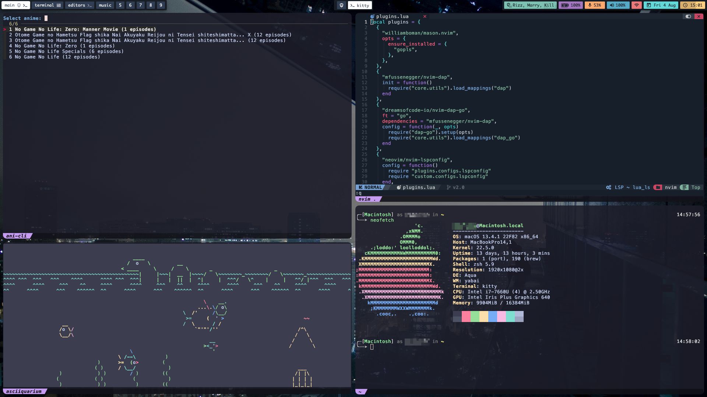

# Mac Dotfiles

This just holds yabai and skhd configs for mac, the configs from the mail folder can be used in here too.
The files are pretty scattered, mostly just grabbed configs from others to test and just left it as is. 

The bar is [simple-bar](https://github.com/Jean-Tinland/simple-bar) used with [ubersicht](https://github.com/felixhageloh/uebersicht)
